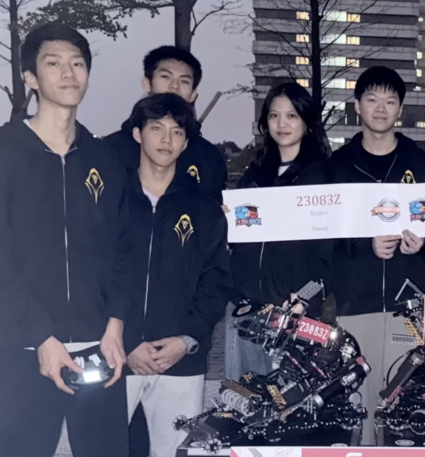
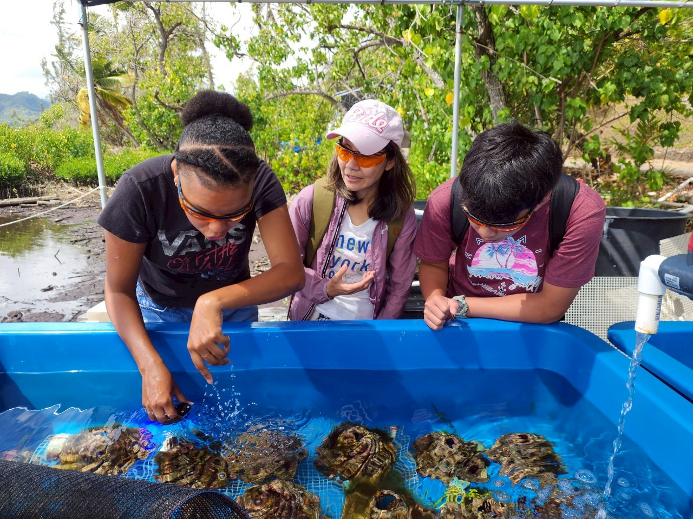
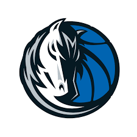

# 🚀 Benjamin Sung | Engineering & Robotics Portfolio

Welcome to my personal portfolio website, designed to showcase my journey in engineering, AI research, and competitive programming. This site is built with a modern, high-tech aesthetic to reflect my passion for system architecture and innovation.

**🌐 Live Site:** [benjisung.github.io](https://benjisung.github.io/)

---

## 🛠️ Tech Stack & Features

- **Frontend:** Vanilla HTML5, CSS3 (Custom Glassmorphism & Animations).
- **Interactive Elements:** Vanilla JavaScript (NBA Mini-Game).
- **Design:** Modern Engineering aesthetic with dynamic RGB lighting and scenic sunset backgrounds.
- **Responsive:** Optimized for both desktop and mobile viewing.

---

## 🌟 Key Highlights

### 🤖 Robotics & Engineering
As the Lead Programmer for the **Wego Robotics Team (VEX)**, I focus on hardware/software integration and advanced control systems. My work has earned multiple accolades, including the **Create Award** and **Sportsmanship Award**.



### 🔬 Marine AI Research
Participant in the **Youth Dream Fulfillment Program**, conducting research at the Hawaii Institute of Marine Biology (HIMB) on coral conservation using AI, drones, and 3D mapping.



### 🏆 Academic Excellence
- **USACO Gold Division**
- **AMC 12 (121.5) / AIME Qualifier (9/15)**
- **BBO Gold Award & USABO Semifinalist**
- **NTU SPROUT Program Participant**

---

## 🏀 Fun & Personal
I am a huge **Dallas Mavericks** fan (MFFL). Check out the "Fun Facts" tab on my website to see my favorite NBA players like **Cooper Flagg** and play the interactive "Guess the NBA Player" mini-game!



---

## 🎓 Academic Affiliation
**Taipei Wego Senior High School**  
IEP Program | Class of 2027

---

## 📂 Project Structure
```text
├── index.html          # Homepage with core highlights
├── about.html          # Detailed biography & school affiliation
├── activities.html     # Comprehensive project log (Robotics, Research, Service)
├── honors.html         # Awards & Olympiad achievements
├── funfacts.html       # NBA Fan Zone & Interactive Mini-Game
├── contact.html        # Let's connect!
├── style.css           # Custom engineering-theme styling
└── images/             # Portfolio assets & project photos
```

---
*Built with ❤️ and Gemini CLI.*
